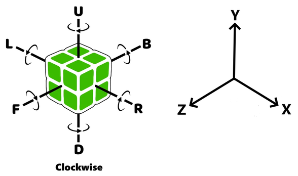
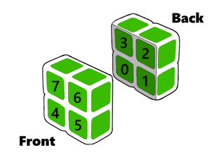
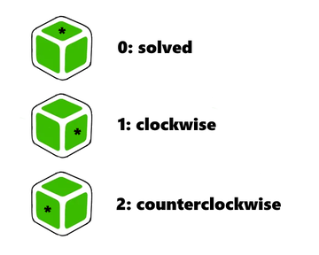

Algorithm Finder for the 2x2x2 Rubik's Cube
===========================================


[](./LICENSE)

# Introduction

In order to solve the 2x2x2 Rubik's cube, the eager puzzle solver will use a carefully selected sequence of algorithms that each perform very specific operations on a small number of corners (cycle, swap, reorient, etc.)

This tools helps you find such algorithms. For example:

- Find an algorithm that swaps two corners of the upper layer (U) while leaving the other two fixed:

```
$ python rubik2x2.py -c **23**76:**00**** --search
Pivot: LDB (0)
Recurse depth: 1
Recurse depth: 2
Recurse depth: 3
Recurse depth: 4
05234176:01000020 4 [ R F R' F' ]
05234176:00000201 4 [ F R F' R' ]
```

- The simple sequence of 4 rotations `R F R' F'` can be composed with the `U` rotation to form an algorithm that cycles the position of 3 corners of the upper layer, with a change in their orientation, while leaving the rest of the cube intact. That operation is called a **commutator**: `(R F R' F') U (R F R' F')' U'`

```
$ python rubik2x2.py -a "R F R' F' U F R F' R' U' " --info
01634572:00000021
++-+++--
orientation_class: 0
perm_cycles: (267)(0)(1)(3)(4)(5)
cyclic_order: 3
```

- The previous algorithm is 10-move long. This tool can find a 8-move algorithm that performs exactly the same operation:

```
$ python rubik2x2.py -c 01634572:00000021 --search
Pivot: LDB (0)
Recurse depth: 1
Recurse depth: 2
Recurse depth: 3
Recurse depth: 4
Recurse depth: 5
Recurse depth: 6
Recurse depth: 7
Recurse depth: 8
01634572:00000021 8 [ R F U' R U F' R' F' ]
01634572:00000021 8 [ R F U' F' U' R' F U ]
01634572:00000021 8 [ R F2 U R U' F2 R' U' ]
01634572:00000021 8 [ U F R F' U' R' U' R ]
01634572:00000021 8 [ U' R' F R U2 F U2 F' ]
01634572:00000021 8 [ U' F U2 R U R' U2 F' ]
01634572:00000021 8 [ F' R U F2 R F2 R' U' ]
01634572:00000021 8 [ F' R' U R F R' U' R ]
01634572:00000021 8 [ F' R' F' U' R U F R ]
```

# Usage

```
$ python rubik2x2.py --help
usage: rubik2x2.py [-h] [--doc] [--show-colors] [--max MAX] [--maxmax] [-c CUBE] [-a ALGO] [-r N] [-p PIVOT] [--info | --solve | --search]

Find algorithms for the 2x2x2 Rubik's cube.

Features:
 - Describe a cube configuration by a set of moves (--algo) or a static position (--cube)
 - Analyze the cube confguration with --info
 - Find algorithms that match a cube pattern with --search
 - Solve the cube with --solve

options:
  -h, --help           show this help message and exit
  --doc                Additional documentation
  --show-colors        Show the association of faces to colors then exit
  --max MAX            Max search depth. (Default: 10)
  --maxmax             Always go to the max search depth
  -c, --cube CUBE      A configuration, or pattern, of the cube. Read the doc with --doc.
  -a, --algo ALGO      Apply an algorithm to the cube. For example: "R U2 R'"
  -r, --algo-repeat N  Repeat the algorithm N times
  -p, --pivot PIVOT    The pivot corner is to remain fixed. (Default: LDB)
  --info               Analyze the cube configuration. (Default action of the script.)
  --solve              Solve the cube
  --search             Search algorithms that match the cube pattern
```

# Tutorial

## Notations

### Move notation

We're using the standard convention to name the cube faces and rotations. That is sometimes refered to as the Singmaster notation. We provide a quick summary below:

The six faces of the Rubik's cube are named:

```
L: Left
R: Right
U: Up
D: Down
F: Front
B: Back
```

The following pairs of faces are aligned along the 3D axis:

```
L/R: X axis
U/D: Y axis
F/B: Z axis
```

The name of each face is also used to designate a clockwise quarter rotation of that face of the cube. The schema below illustrates this:



This schema is adapted from the content of website [myrubik.com](https://myrubik.com/), shared under [CC BY-NC](https://creativecommons.org/licenses/by-nc/4.0/) license.

Read more about Singmaster's move notation of the Rubik's cube on [myrubik.com -- The 2x2x2 cube pieces and notation](https://myrubik.com/en/notation/2x2x2), and [rubiks.fandom.com -- Notation](https://rubiks.fandom.com/wiki/Notation).

### Static notation

The script uses a custom notation to capture any position of the 2x2x2 cube (including [illegal positions not reachable from the solved state](https://www.speedcubing.com/chris/legal.html)).

For example, the cube after the two moves "R U" is represented by the static position: `05124763:01200210`. That notation is documented [in details here](./doc/cube_static_notation.md), and below is a quick reference sheet:

- The corners are enumerated in the following order:



- The orientation of the corners is shown below. We represent with a star ( * ) the face of the corner that is up (U) or down (D) in the solved state. With the Western color scheme, the * face is either the white or the yellow one.



## The basics

### 1. The solved cube

Run the script without arguments to generate the default state of the cube, that is the solved state, encoded by the static position `01234567:00000000`, that can be read as follows:
- The permutation of the corners `01234567` is the identity operation (all corners are fixed)
- The orientation of the corners `00000000` is the orientation of the solved state.

```
$ python rubik2x2.py
01234567:00000000
++++++++
orientation_class: 0
perm_cycles: (0)(1)(2)(3)(4)(5)(6)(7)
cyclic_order: 1
```

The other information in the output will be detailed with the next example, where it is more relevant than in the trivial initial state of the cube.

For now, notice the **orientation_class**, which can be one of three values: 0, 1, 2. Colloquially called _parity_, it represents the three equivalence classes of the 2x2x2 Rubik's cube. To summarize, all legal rotations of the cube will preserve the orientation class. Therefore, all algorithms applied to a solved cube will produce a cube configuration with orientation_class = 0. On the contrary, cube configurations with orientation_class equal to 1 or 2 cannot be obtained from the solved cube using only rotations. They are [illegal positions not reachable from the solved state](https://www.speedcubing.com/chris/legal.html).

### 2. A single rotation

Let's apply the rotation `R` to the solved cube. It is a quarter-turn clockwise rotation of the right (R) face.

```
$ python rubik2x2.py --algo "R" --info
05134627:01200210
+--++--+
orientation_class: 0
perm_cycles: (1562)(0)(3)(4)(7)
cyclic_order: 4
```

Here is the information that can be found in the output:

- `05134627:01200210` is a string encoding the **static position** of the cube after the rotation. To interpret it, please read about [the static notation](./doc/cube_static_notation.md).
- The `+--++--+` string right under the permutations `05134627` marks with a `-` the corners that have moved, `~` the corners that are at their position but have changed orientation, and with a `+` the corners that are fixed.
- `orientation_class` is 0. As explained above, all legal moves applied to a solved cube will produce a configuration with orientation_class = 0.
- `perm_cycles` are the **permutation cycles**. It is a way to represent the permutation of the corners by isolating the cycles. The corners of the right face are on a 4-cycle (1 -> 5 -> 6 -> 2). The corners of the left face (0, 3, 4, 7) are fixed.
- The `cyclic_order` is the minimum number of iterations of the algorithm needed to go back to the solved state. All transformations on the cube will cycle, and the theoretical maximum order of that cycle is 45 for the 2x2x2 Rubik's cube.
The cyclic order of rotation `R` is 4. Indeed, four quarter-turns will return to the initial position of the cube.

## Describe a cube configuration

The user can describe a cube configuration in two ways:

- With the `--algo` / `-a` option, specify a sequence of moves that will be applied to the initial state:

```
$ python rubik2x2.py --algo "R U R"
06514723:00020220
+---+---
orientation_class: 0
perm_cycles: (162573)(0)(4)
cyclic_order: 6
```

- Aternatively, with the `--cube` / `-c` option, specify the static position of the cube:

```
$ python rubik2x2.py -c 06514723:00020220
... Same output as above ...
```

## Analyze a cube configuration

Use the `--info` flag, or no flag at all, since this is the default behavior of the script, to analyze the current cube configuration.

```
$ python rubik2x2.py --algo "R U R" --info
06514723:00020220
+---+---
orientation_class: 0
perm_cycles: (162573)(0)(4)
cyclic_order: 6
```

Notice the permutation cycles show a cycle of six corners of the cube, while corners 0 and 4 are fixed. And the cyclic order of the algorithm "R U R" is 6. Meaning, repeating the operation 6 times returns the cube to the solved state. We can verify that with option `--algo-repeat`:

```
$ python rubik2x2.py --algo "R U R" --algo-repeat 6 --info
01234567:00000000
++++++++
orientation_class: 0
perm_cycles: (0)(1)(2)(3)(4)(5)(6)(7)
cyclic_order: 1
```

## Find an algorithm that match a cube pattern

### Pivot

The search function of the script assumes at least one corner is fixed during the rotations. This is in order to reduce the search space, without loss of generality. By default, that pivot is corner 0 (LDB), meaning the only
allowed rotations are on the R (right), U (up) and F (front) faces of the cube.

This can be changed with the `--pivot` option. The expected pivot is a three-letter string.

### One example of search

Use the `--search` option to search algorithms that produce a precise cube configuration, or a pattern containing the wildcard character '*' (meaning "any").

Let's identify algorithms that leave the back face (B) invariant. Unsusprisingly, the search returns all the front (F) rotations:

```
$ python rubik2x2.py -c 0123****:0000**** --search
Pivot: LDB (0)
Recurse depth: 1
01237456:00002121 1 [ F ]
01236745:00000000 1 [ F2 ]
01235674:00002121 1 [ F' ]
```

Going a little further, if we force the search to look deeper, until depth 5, we find several 5-move algorithms with the same property:

```
$ python rubik2x2.py -c 0123****:0000**** --search --max 5 --maxmax
Pivot: LDB (0)
[...]
Recurse depth: 5
01235674:00001212 5 [ R2 F2 R F2 R2 ]
01236745:00000000 5 [ R2 F2 R2 F2 R2 ]
01237456:00001212 5 [ R2 F2 R' F2 R2 ]
01235674:00000000 5 [ U2 F2 U F2 U2 ]
01236745:00000000 5 [ U2 F2 U2 F2 U2 ]
01237456:00000000 5 [ U2 F2 U' F2 U2 ]
01237456:00002121 1 [ F ]
01236745:00000000 1 [ F2 ]
01235674:00002121 1 [ F' ]
runtime: 0.087 seconds
```

## Solve the cube

Use the `--solve` option to solve the cube from a given cube position (not a pattern with wildcards!). The solver also expects a pivot corner that remains fixed throughout the whole algorithm. Below is an example of a solve. We set the pivot to corner 3, although the default pivot (0) would have worked just fine, but would have produced different algorithms.

```
$ python rubik2x2.py -c 01234567:00002121 -p LUB --solve
Pivot: LUB (3)
Recurse depth: 1
Recurse depth: 2
Recurse depth: 3
Recurse depth: 4
Recurse depth: 5
Recurse depth: 6
01234567:00000000 6 [ D2 F2 D F2 D2 F ]
01234567:00000000 6 [ D2 F2 D' F2 D2 F' ]
01234567:00000000 6 [ F R2 F2 R F2 R2 ]
01234567:00000000 6 [ F' R2 F2 R' F2 R2 ]
runtime: 0.616 seconds
```

# Color scheme

An optional `config.ini` file can be provided to set a color scheme.

Examples of config files are given for the most common color schemes: [./config/config_japanese.ini](./config/config_japanese.ini), [./config/config_western.ini](./config/config_western.ini)

Option `--show-colors` of the script prints out the current color scheme:

```
$ python rubik2x2.py --show-colors

Faces:
    R: red
    L: orange
    U: white
    D: yellow
    F: green
    B: blue

Corners:
    0 (LDB): orange-yellow-blue
    1 (RDB): red-yellow-blue
    2 (RUB): red-white-blue
    3 (LUB): orange-white-blue
    4 (LDF): orange-yellow-green
    5 (RDF): red-yellow-green
    6 (RUF): red-white-green
    7 (LUF): orange-white-green
```

# Maintenance

## Requirements

* __Python 3.x__: http://www.python.org/download/

No `requirements.txt` at the moment.

## Unit tests

```
python -m unittest -v
```

## Static checks

```
pylint  $(git ls-files '*.py')
ruff check
mypy .
```

# God's number

To this repo we annexed a C++ program that finds the [God's number](https://en.wikipedia.org/wiki/God%27s_algorithm) of the 2x2x2 Rubik's cube.

Please read: [cpp/README.md](cpp/README.md)

The convention used to describe a static configuration of the cube (position and orientation of the corners) is the same in the C++ project and in the Python script.

# References

This tool was greatly influenced by an article [1] written by mathematician Emmanuel Halberstadt, in the French journal Pour la Science.

- [1] Emmanuel Halberstadt, "Cube hongrois et théorie des groupes", Pour la Science, 1980.
